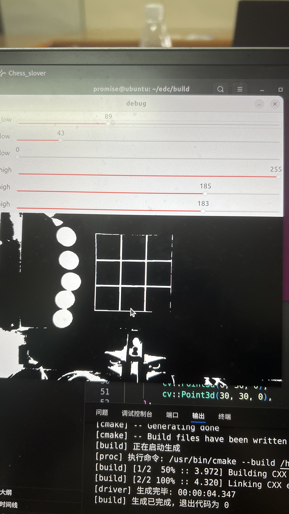
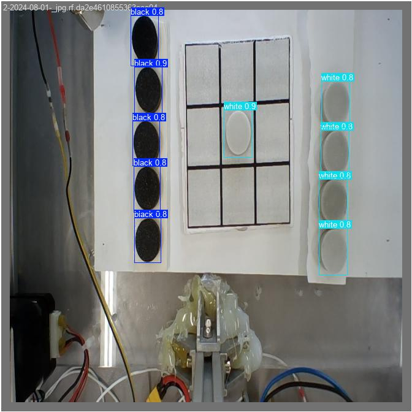
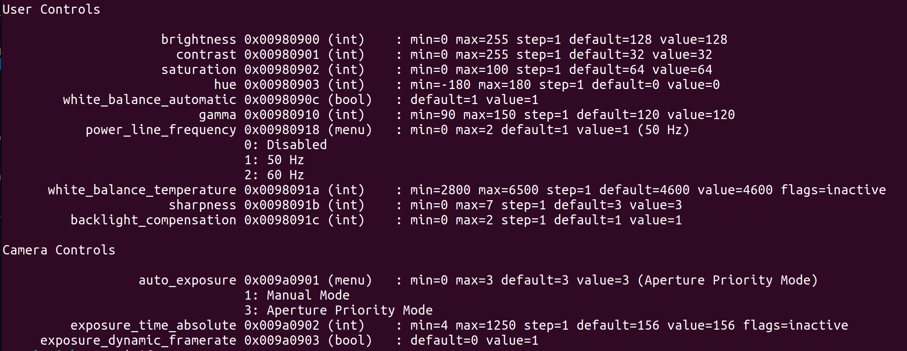

# edc_2024_E
## 2024年电赛E题视觉寄录

棋盘识别使用OpenCV传统视觉。棋子识别基于yolov8目标检测网络，使用OpenCV的dnn模块推理。串口模块使用[CSerialPort](https://github.com/itas109/CSerialPort)库，基于[visionSerial](https://github.com/prom-se/visionSerial)模块修改而来。

## 文件结构
    ├── inference.cpp           # yolov8推理模块，官方开源
    ├── CMakeLists.txt          # CMake
    ├── chess_slover.cpp        # 主程序
    ├── model                   # yolov8模型文件夹
    │   ├── classes.txt
    │   ├── chess.onnx
    │   ├── chess_16_42.onnx
    │   ├── chess_02_40.onnx
    │   ├── chess_05_52.onnx
    │   ├── chess_0809.onnx
    │   └── last.onnx           # 测评时使用的模型
    ├── LICENSE
    ├── include                 # 头文件
    │   ├── inference.h         # 推理模块头文件
    │   ├── packet.hpp          # 数据包定义
    │   ├── serial_driver.hpp   # 串口模块
    │   └── board.hpp           # 棋盘模块
    └── README.md               # 本文件
## 软硬件平台
- OrangePi5 8G
- UVC摄像头 720p60hz
- Ubuntu 22.04 LTS
- OpenCV 4.10 编译安装
- 香橙派5供电必须5V4A 否则满载时会自动重启
---
识别模块测评时效果很好，主要因为使用了OpenCV的trackbar实现动态调参，所以对灯光要求不大,也不需要补光灯。因为整个任务对识别帧率要求不高，但对棋子识别的准确度要求高，所以棋子识别最后使用的是v8m的模型，效果比v8s好很多。对弈逻辑基于评估函数的思路手搓实现，可能并不是最优解。测评现场继电器寄了，视觉白干。
## 动态调参

## yolov8m模型验证（val）

## 查看摄像头支持修改的参数
因为OpenCV中VideoCapture实现了很多参数的修改,但我们手中的摄像头可能并不支持修改。可以使用下列命令查看摄像头的可修改参数和修改范围。

    v4l2-ctl -d /dev/video0 --all

User Controls和Camera Controls即为可调参数

注：以上参数数值仅在使用V4L2的api调用摄像头时才有意义

## OpenCV调用USB摄像头，修改自动曝光等参数
    cam_ = cv::VideoCapture(cam_name_, cv::CAP_V4L2); // 使用V4L2调用，在OpenCV中等同于V4L
    cam_.set(cv::CAP_PROP_FOURCC, cv::VideoWriter::fourcc('M', 'J', 'P', 'G'));
    cam_.set(cv::CAP_PROP_FRAME_WIDTH, 1280);
    cam_.set(cv::CAP_PROP_FRAME_HEIGHT, 720);
    cam_.set(cv::CAP_PROP_FPS, 60);
    cam_.set(cv::CAP_PROP_AUTO_EXPOSURE, 1); //从上图可知1为手动曝光，3为自动曝光
    cam_.set(cv::CAP_PROP_EXPOSURE, exp);
    cam_.set(cv::CAP_PROP_AUTO_WB, 1);